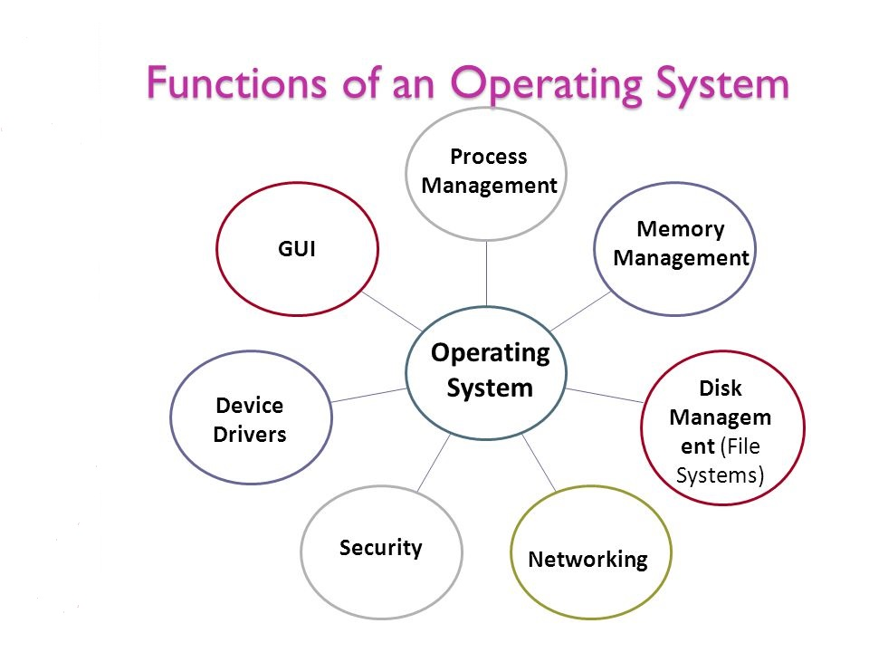

## Operating System Functions and Services

An operating system (OS) is essential software that acts as an intermediary between computer hardware and application programs, providing a platform for users to interact with the system and execute programs efficiently. Below is a detailed explanation of its functions and services, along with a representation.

---

### **Core Functions of an Operating System**

1. **Memory Management**

   - Allocates and manages primary memory (RAM) for processes.
   - Ensures efficient memory utilization by handling allocation, deallocation, and swapping of memory spaces.

2. **Process Management**

   - Manages the execution of multiple processes using techniques such as multitasking, scheduling, and synchronization.
   - Handles process creation, termination, and resource allocation.

3. **File System Management**

   - Organizes, stores, retrieves, and manipulates data on storage devices.
   - Provides a hierarchical structure for file organization and access permissions.

4. **Device Management**

   - Facilitates communication between hardware devices (e.g., printers, keyboards) and application software.
   - Uses device drivers to translate high-level commands into hardware-specific instructions.

5. **Security**

   - Protects data and resources through authentication mechanisms like passwords or encryption.
   - Prevents unauthorized access and ensures data integrity.

6. **Error Detection and Handling**

   - Monitors the system for errors in hardware or software.
   - Takes corrective actions to maintain system stability.

7. **User Interface**
   - Provides interfaces such as Command-Line Interface (CLI) or Graphical User Interface (GUI) for user interaction with the system.

---

### **Key Services Provided by an Operating System**

1. **Program Execution**

   - Ensures smooth execution of user and system programs by managing resources like CPU time and memory.

2. **Input/Output Operations**

   - Handles all input from devices like keyboards or mice and output to monitors or printers.

3. **Resource Allocation**

   - Allocates CPU cycles, memory space, and I/O devices to various processes based on priority or scheduling algorithms.

4. **File Manipulation**

   - Manages file creation, deletion, reading, writing, and storage across different media.

5. **System Performance Monitoring**
   - Tracks system performance metrics to optimize resource usage and identify bottlenecks.

---

### **Representation of OS Functions**

Below is a simplified representation of how an operating system functions:

| Function               | Description                                                                |
| ---------------------- | -------------------------------------------------------------------------- |
| Memory Management      | Allocates RAM to processes; handles swapping between RAM and disk storage. |
| Process Management     | Manages running applications; schedules CPU time for tasks.                |
| File System Management | Organizes data into files/directories; controls access permissions.        |
| Device Management      | Coordinates communication between hardware devices and applications.       |
| Security               | Implements authentication; protects against unauthorized access.           |
| Error Handling         | Detects faults in hardware/software; ensures stable operation.             |

This table summarizes the primary responsibilities of an OS in managing both hardware resources and user interactions.

By performing these functions efficiently, the operating system ensures that users can run applications seamlessly while abstracting the complexities of hardware management.
