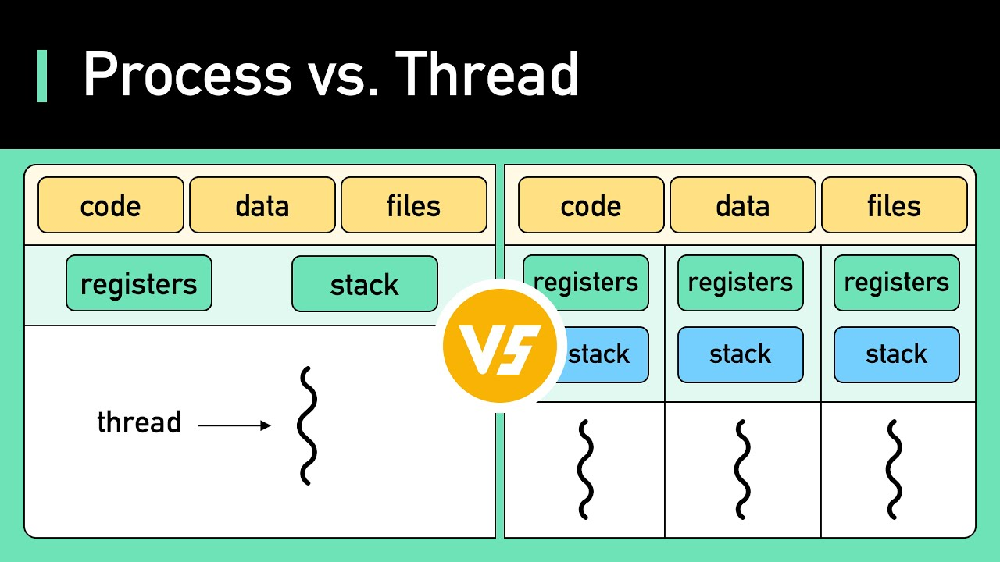

A **process** is an instance of a program in execution, managed by the operating system (OS) through a **Process Control Block (PCB)**, while a **thread** is a lightweight unit of execution within a process. Multithreading enables concurrent execution of threads, improving efficiency and resource utilization. Below is a detailed breakdown:

---

## Processes and PCB

- **Process Control Block (PCB):**  
  A data structure containing all information needed to manage a process, including:

  - **Execution state** (ready, running, waiting), program counter (PC), stack pointer (SP), and CPU registers.
  - **Memory management info** (e.g., allocated memory, open files).
  - **Scheduling details** (priority, resources used).

- **Process Lifecycle:**
  - Created during system boot, by other processes, or user actions.
  - Terminates via normal exit, error, or termination by another process.
  - **Context switching** suspends a process by saving its state in the PCB and restoring another process’s state.

---

## Threads and Multithreading

- **Threads:**  
  Subunits of a process that share the process’s resources (memory, files) but have their own **Thread Control Block (TCB)** containing thread-specific data (e.g., identifier, execution snapshot).

| **Feature**           | **Process**                          | **Thread**                            |
| --------------------- | ------------------------------------ | ------------------------------------- |
| **Definition**        | Program in execution                 | Segment of a process                  |
| **Resource Usage**    | Heavyweight; requires more resources | Lightweight; shares process resources |
| **Context Switching** | Slower due to PCB involvement        | Faster as only TCB is swapped         |
| **Failure Impact**    | Independent of other processes       | Affects sibling threads               |

- **Multithreading Models:**
  - **Many-to-One:** Multiple user threads map to one kernel thread (limited parallelism).
  - **One-to-One:** Each user thread maps to a kernel thread (supports concurrency, higher overhead).
  - **Many-to-Many:** Flexible mapping of user threads to kernel threads (balances concurrency and efficiency).

---

## Benefits of Multithreading

- **Efficiency:** Reduces context-switching overhead compared to processes.
- **Concurrency vs. Parallelism:**
  - _Concurrency:_ Threads interleave on a single CPU (e.g., I/O-bound tasks like file downloads).
  - _Parallelism:_ Threads run simultaneously on multiple CPUs (e.g., matrix multiplication).
- **Resource Sharing:** Threads share memory and files, simplifying communication.

---

### Example of Multithreading

In a spreadsheet application:

- Adjusting column widths, auto-saving, and replicating cells occur concurrently via threads without blocking the main program.

This structure ensures efficient process management and optimal resource allocation, enabling modern multitasking capabilities.
