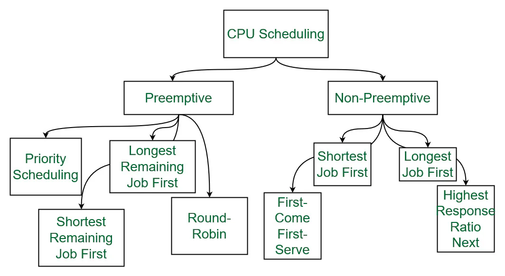

CPU scheduling is a fundamental mechanism in operating systems that determines how processes are allocated to the CPU to optimize resource utilization and system performance. It ensures efficient execution of multiple processes by managing their order and duration of access to the CPU. Below is a detailed explanation of its two primary types: **preemptive** and **non-preemptive** scheduling.

## 

## Preemptive Scheduling

In preemptive scheduling, the CPU can interrupt an executing process to allocate resources to a higher-priority or time-critical process. This approach ensures flexibility and responsiveness, particularly in multitasking environments.

**Key characteristics**:

- Processes are assigned fixed time slices (quantums) for execution.
- A running process can be paused if a higher-priority process enters the ready queue.
- Requires mechanisms like **context switching** and a **dispatcher** to manage interruptions.

**Example**:  
If Process A (low priority) is running and Process B (high priority) arrives, the CPU will halt Process A, save its state, and start Process B immediately. Algorithms like **Round Robin** and **Shortest Remaining Time First (SRTF)** use this method.

**Advantages**:

- Better for real-time systems due to minimized response times.
- Prevents CPU monopolization by long-running processes.

**Disadvantages**:

- Overhead from frequent context switches.
- Complexity in managing shared resources and synchronization.

---

## Non-Preemptive Scheduling

In non-preemptive scheduling, a process retains the CPU until it completes execution or voluntarily releases it (e.g., during I/O waits). This method prioritizes simplicity over flexibility.

**Key characteristics**:

- No interruptions occur once a process starts executing.
- Scheduling decisions happen only when a process terminates or moves to a waiting state.

**Example**:  
In a **First-Come, First-Served (FCFS)** scenario, Process P2 starts at time 0. Subsequent processes (P0, P1, P3) wait in the ready queue until P2 finishes, even if they arrive earlier. Algorithms like **Non-Preemptive Shortest Job First (SJF)** use this approach.

**Advantages**:

- Lower overhead due to fewer context switches.
- Predictable execution order.

**Disadvantages**:

- Risk of longer waiting times for high-priority processes.
- Poor responsiveness in interactive systems.

---

### Comparison of Preemptive vs. Non-Preemptive

| Criteria           | Preemptive Scheduling        | Non-Preemptive Scheduling      |
| ------------------ | ---------------------------- | ------------------------------ |
| **Interruption**   | Processes can be interrupted | No interruptions allowed       |
| **Overhead**       | Higher (context switching)   | Lower                          |
| **Responsiveness** | High                         | Low                            |
| **Use Cases**      | Real-time, multitasking      | Batch processing, simple tasks |
| **Algorithms**     | Round Robin, SRTF            | FCFS, Non-preemptive SJF       |

---

## Scheduling Criteria and Objectives

CPU scheduling aims to:

1. **Maximize CPU utilization** by reducing idle time.
2. **Increase throughput** (number of processes completed per unit time).
3. **Minimize turnaround time** (total time from arrival to completion).
4. **Reduce waiting time** (time spent in the ready queue).

By balancing these goals, scheduling algorithms ensure efficient resource allocation and enhance system performance across diverse computing environments.
