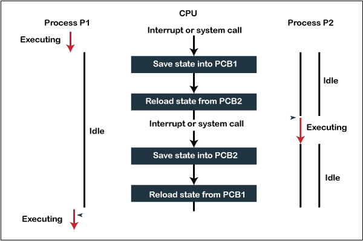

## Context Switching Overview

Context switching is a fundamental technique used by operating systems to manage multiple processes on a single CPU. It allows the system to switch between processes efficiently, ensuring that each process can resume execution from where it left off.

### Why Context Switching is Needed

1. **Resource Sharing**: Context switching enables multiple processes to share a single CPU, making it possible for the system to handle multiple tasks simultaneously without needing additional processors.
2. **Process Priority**: It allows high-priority processes to interrupt lower-priority ones, ensuring timely execution of critical tasks.
3. **Interrupt Handling**: When an interrupt occurs, context switching saves the current process state, allowing the system to handle the interrupt and then resume the process.

### Steps of Context Switching

The process involves the following steps:

1. **Save the State of the Current Process**: The operating system saves the current state of the running process, including its program counter and register values, into a Process Control Block (PCB).
2. **Update the PCB and Move the Process**: The PCB is updated, and the process is moved to an appropriate queue (e.g., ready, I/O, or waiting).
3. **Select the Next Process**: The system selects a new process from the ready queue based on scheduling algorithms.
4. **Restore the State of the Selected Process**: The saved state of the new process is loaded into the CPU, and it begins execution.
5. **Resume Execution**: The selected process resumes execution from where it was paused.

### Representation

To illustrate context switching, consider two processes, **P1** and **P2**:

- **Initial State**: Process **P1** is running on the CPU, while **P2** is in the ready state.
- **Trigger Event**: An interrupt occurs or **P2** becomes ready with higher priority.
- **Context Switch**:
  1. Save **P1**'s state (program counter, registers) to its PCB.
  2. Update **P1**'s PCB and move it to the ready queue.
  3. Select **P2** from the ready queue.
  4. Load **P2**'s saved state from its PCB into the CPU.
  5. **P2** begins execution.
- **Repeat**: When **P2** is interrupted or completes its time slice, the process repeats, switching back to **P1** or another process.

### Example

Suppose you are working on a computer with multiple applications open (e.g., a web browser and a word processor). Context switching allows the CPU to switch between these applications quickly, giving the illusion that they are running simultaneously.

### Performance Impact

While context switching is essential for multitasking, it incurs overhead due to the time spent saving and loading process states. This can impact system performance, especially if context switches occur frequently.

In summary, context switching is a critical mechanism that enables efficient multitasking by allowing multiple processes to share a single CPU, ensuring each process resumes execution from where it was paused.
