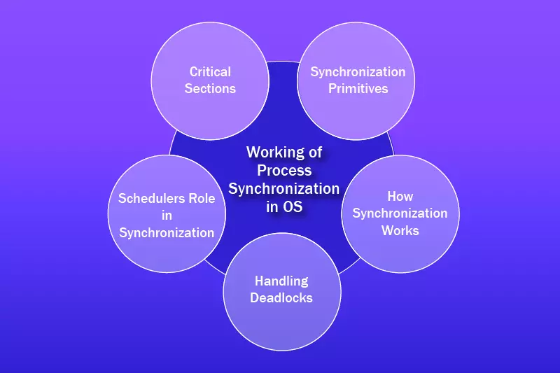

Process synchronization ensures orderly execution of concurrent processes accessing shared resources, preventing data corruption and race conditions. Key mechanisms include managing critical sections, semaphores, and mutex locks, which coordinate access to resources while maintaining system stability.

## 

## Critical Section Problem

The **critical section** is a code segment where processes access shared resources. Concurrent access here creates **race conditions**, leading to inconsistent results[3]. For example:

- Two processes incrementing a shared variable `x=0` simultaneously might both read `x=0`, increment to 1, resulting in `x=1` instead of 2.

### Requirements for Solutions

1. **Mutual Exclusion**: Only one process can execute in the critical section at a time.
2. **Progress**: If no process is in the critical section, a requesting process must enter without delay.
3. **Bounded Waiting**: No process waits indefinitely to enter the critical section.

**Representation**:

```python
while True:
    # Entry section (request access)
    # Critical section (access shared resource)
    # Exit section (release access)
    # Remainder section (non-critical code)
```

---

## Semaphores

Semaphores are integer-based signaling mechanisms that control access to shared resources via **wait (P)** and **signal (V)** operations.

### Types

- **Binary Semaphore**: Value 0 or 1 (locked/unlocked).
- **Counting Semaphore**: Value ≥0, allowing multiple instances of a resource.

**Example Implementation**:

```python
semaphore mutex = 1  # Initialize semaphore

# Process 1
P(mutex)             # Wait: If mutex > 0, decrement and proceed
# Critical Section
V(mutex)             # Signal: Increment mutex

# Process 2
P(mutex)
# Critical Section
V(mutex)
```

- **P()** checks and decrements the semaphore.
- **V()** increments and wakes waiting processes.

**Use Case**:

- Managing 4 identical printers with a counting semaphore initialized to 4, allowing up to 4 processes simultaneous access.

---

## Mutex Locks

Mutex (Mutual Exclusion) locks are binary locks ensuring only one thread/process accesses a resource. Unlike semaphores, they are **owner-aware** and support reentrancy in some implementations.

**Python Example**:

```python
import threading

shared_resource = 0
mutex = threading.Lock()

def increment():
    global shared_resource
    mutex.acquire()
    shared_resource += 1  # Critical section
    mutex.release()

# Create multiple threads to run increment()
```

**Key Benefits**:

- Prevents race conditions via atomic lock/unlock.
- Avoids priority inversion (with proper implementation).

---

## Comparison of Mechanisms

| Mechanism          | Type          | Use Case                      | Ownership Tracking |
| ------------------ | ------------- | ----------------------------- | ------------------ |
| Binary Semaphore   | Integer (0/1) | Single-resource access        | No                 |
| Mutex              | Lock          | Single-thread resource access | Yes                |
| Counting Semaphore | Integer (≥0)  | Multi-instance resource pools | No                 |

Semaphores and mutexes form the backbone of process synchronization, balancing efficiency and safety in systems ranging from databases to real-time applications.
