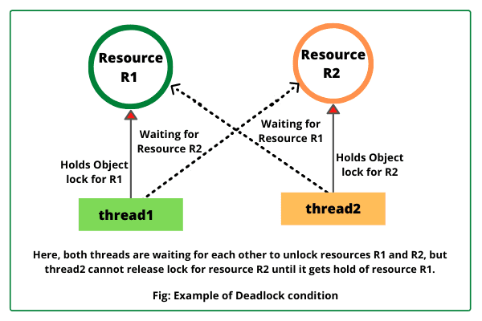

Deadlocks occur in operating systems when multiple processes are unable to proceed because each holds a resource needed by another, creating a cyclic dependency. This issue arises only when four conditions coexist: **mutual exclusion**, **hold and wait**, **no preemption**, and **circular wait**. Below is an organized explanation of prevention/avoidance techniques and their representations.

## 

## Deadlock Prevention Techniques

These strategies **break at least one necessary condition** to eliminate deadlock risks:

**1. Mutual Exclusion Mitigation**

- Allow resource sharing where possible (e.g., read-only files) to bypass exclusive access requirements.

**2. Eliminate Hold and Wait**

- Require processes to request **all resources upfront** before execution, ensuring they cannot hold resources while waiting for others.

**3. Enable Resource Preemption**

- Forcefully reclaim resources from processes if needed (e.g., transaction rollbacks in databases).

**4. Prevent Circular Wait**

- Enforce a **global ordering of resources** (e.g., R1 < R2 < R3). Processes must request resources in ascending order, eliminating cyclic dependencies.

---

## Deadlock Avoidance Techniques

These methods dynamically assess resource allocation safety:

**1. Banker’s Algorithm**

- Uses a **safety check** before allocating resources. The system simulates allocations to ensure processes can complete without deadlock.

#### Example Scenario:

| Process | Max Need | Allocated | Remaining Need |
| ------- | -------- | --------- | -------------- |
| P1      | 9        | 5         | 4              |
| P2      | 5        | 2         | 3              |
| P3      | 3        | 1         | 2              |

With **2 free resources**, the safe sequence is:

1. Allocate 2 to P3 → P3 finishes, releases 3 resources.
2. Allocate 3 to P2 → P2 finishes, releases 5 resources.
3. Allocate 4 to P1 → P1 finishes.

**2. Resource-Allocation Graph**

- **Nodes**: Processes (squares) and resources (circles).
- **Edges**:
  - **Request**: Process → Resource (dashed line).
  - **Assignment**: Resource → Process (solid line).

A **cycle** in this graph indicates a potential deadlock.

---

## Visual Representations

### 1. Resource-Allocation Graph

 | R2 (Max) | Allocated R1 | Allocated R2 |  
|---------|----------|----------|--------------|--------------|  
| P1 | 3 | 2 | 1 | 2 |  
| P2 | 2 | 3 | 2 | 1 |

The algorithm calculates **available resources** and simulates allocations to verify safe sequences.

---

By combining prevention strategies like resource ordering with avoidance mechanisms such as the Banker’s Algorithm, operating systems minimize deadlock risks while maintaining efficient resource utilization.
