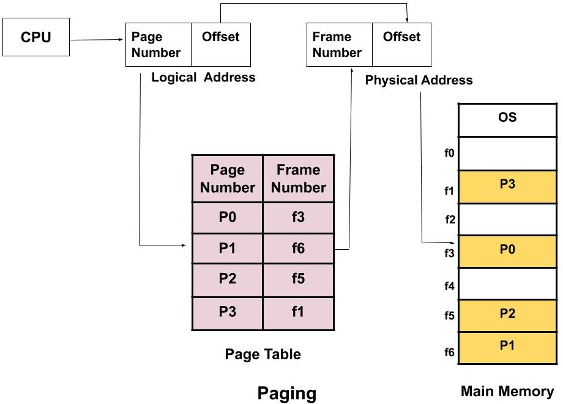

Paging and segmentation are memory management techniques that enable efficient allocation of physical memory to processes. Paging divides memory into fixed-size blocks, while segmentation uses variable-sized logical units. Both approaches facilitate non-contiguous memory allocation, allowing processes to use memory more flexibly than contiguous allocation methods.

## Paging

Paging partitions physical memory into **fixed-size frames** (e.g., 4 KB) and divides processes into equally sized **pages**. The operating system maps pages to frames using a hardware-managed **page table**.

**Key mechanisms:**

- **Address translation**: Logical addresses split into:
  - Page number $$ p $$: Indexes the page table
  - Page offset $$ d $$: Directly maps to physical offset  
    Physical address = Frame number (from page table) × Page size + Offset
- **Page tables**: Store frame numbers for each page, managed by the Memory Management Unit (MMU).

**Example representation:**  
For a process with 4 pages (P0–P3) and 4 memory frames:
| Logical Page | Physical Frame |
|--------------|----------------|
| P0 | F1 |
| P1 | F3 |
| P2 | F0 |
| P3 | F2 |  
_Pages are loaded non-contiguously, eliminating external fragmentation._

**Advantages:**

- Minimal external fragmentation
- Simplified swapping via fixed-size units
- Hardware acceleration for address translation

**Disadvantages:**

- Internal fragmentation (unused space within pages)
- Overhead from multi-level page tables

---

## Segmentation

Segmentation divides processes into **variable-sized segments** (e.g., code, data, stack) that reflect logical program structure. Each segment has a base address and length stored in a **segment table**.

**Key mechanisms:**

- **Address translation**: Logical addresses split into:
  - Segment number **s**: Indexes segment table
  - Segment offset **d**: Must be ≤ segment length  
    Physical address = Segment base (from table) + Offset
- **Protection**: Segments can enforce read/write/execute permissions.

**Example representation:**  
| Segment | Base Address | Length |
|---------|--------------|---------|
| Code | 0x4000 | 0x1000 |
| Data | 0x8000 | 0x0800 |  
_Segments may be scattered in memory but retain logical grouping._

**Advantages:**

- Natural alignment with program structure
- Fine-grained access control
- Easier code/data sharing between processes

**Disadvantages:**

- External fragmentation (gaps between variable-sized segments)
- Complex memory allocation algorithms

---

## Hybrid Approach: Segmented Paging

Modern systems often combine both techniques:

1. Divide processes into logical segments
2. Further split segments into fixed-size pages
3. Use **segment tables** to point to **page tables** for each segment.

**Address translation steps:**

1. Use segment number **s** to find page table base in segment table
2. Use page number **p** to locate frame in page table
3. Combine frame number with offset **d**:  
    **\text{Physical Address} = (\text{Frame Number} \times \text{Page Size}) + d**  
   This hybrid method reduces external fragmentation while maintaining logical organization.

---

## Comparison Table

| Feature               | Paging                        | Segmentation                |
| --------------------- | ----------------------------- | --------------------------- |
| **Memory Division**   | Fixed-size pages              | Variable-sized segments     |
| **Fragmentation**     | Internal                      | External                    |
| **Management**        | Hardware (page tables)        | Software (segment tables)   |
| **Visibility**        | Transparent to programmers    | Exposed to programmers      |
| **Address Structure** | Single-part (page + offset)   | Two-part (segment + offset) |
| **Performance**       | Faster (hardware-accelerated) | Slower (software overhead)  |

_Adapted from_

Both techniques optimize memory utilization but cater to different needs: paging prioritizes efficiency and simplicity, while segmentation emphasizes logical organization and security. Most contemporary systems use paging as the primary method, with segmentation limited to specific use cases like memory protection.
