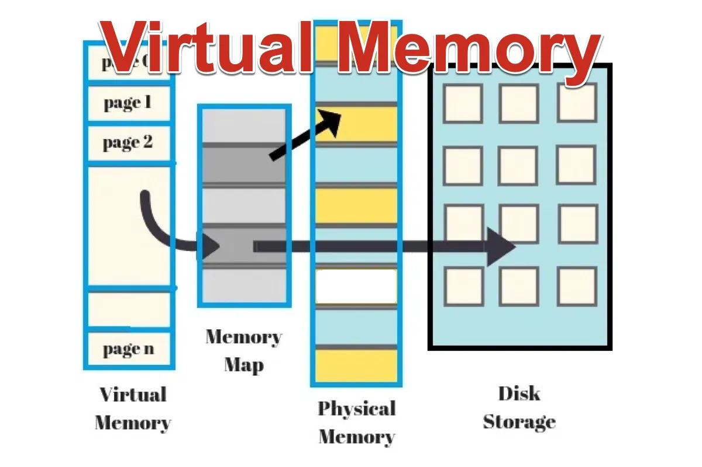

Virtual memory is a memory management technique that creates an illusion of a larger main memory by utilizing secondary storage, allowing systems to run multiple applications efficiently even with limited physical RAM. It operates through two key mechanisms: **demand paging** and **page replacement algorithms**.



## **Demand Paging**

Demand paging loads only the essential parts of a program into memory initially, fetching additional pages from secondary storage only when needed. Here's how it works:

1. **Initial Load**: Only the starting pages required for program execution are loaded into RAM.
2. **Page Fault Handling**:
   - If a process accesses a page not in memory (a **page fault**), the OS retrieves it from the disk.
   - The page table updates to map the new physical address.
3. **Benefits**:
   - Reduces memory usage by avoiding upfront loading of entire programs.
   - Speeds up application startup and improves system responsiveness.

**Example Workflow**:

1. Process requests Page X.
2. If Page X is not in RAM (page fault), the OS pauses the process.
3. OS locates Page X on disk, swaps it into a free frame.
4. Page table updates, and the process resumes.

---

## **Page Replacement Algorithms**

When memory is full and a page fault occurs, the OS uses algorithms to decide which page to replace:

| **Algorithm**                 | **Description**                                                                 | **Use Case**                      |
| ----------------------------- | ------------------------------------------------------------------------------- | --------------------------------- |
| **FIFO**                      | Replaces the oldest page in memory. Simple but may eject frequently used pages. | Basic systems with uniform usage  |
| **LRU (Least Recently Used)** | Evicts the page least recently accessed. More efficient but requires tracking.  | Systems needing temporal locality |
| **Optimal**                   | Theoretically replaces the page that will not be used for the longest time.     | Benchmarking (not practical)      |

**Steps in Page Replacement**:

1. Identify a victim page using the selected algorithm.
2. Write the victim page back to disk if modified.
3. Load the new page into the freed frame.
4. Update the page table and restart the interrupted instruction.

---

## **System Representation**

- **Virtual Address Space**: Divided into pages (e.g., 4KB each).
- **Physical Memory**: Divided into frames of the same size.
- **Page Table**: Maps virtual pages to physical frames or disk locations.
- **MMU (Memory Management Unit)**: Hardware that translates virtual addresses to physical addresses using the page table.

```
+---------------------+       +-------------------+
| Virtual Address     |       | Physical Memory   |
| (Process View)      |       | (Actual RAM)      |
| Page 0 → Disk       |       | Frame 0: Page 2   |
| Page 1 → Frame 3    |       | Frame 1: Page 5   |
| Page 2 → Frame 0    |       | Frame 2: (Free)   |
| ...                 |       +-------------------+
+---------------------+
```

By combining demand paging and intelligent page replacement, virtual memory enables efficient multitasking, maximizes RAM utilization, and provides scalability for memory-intensive applications.
