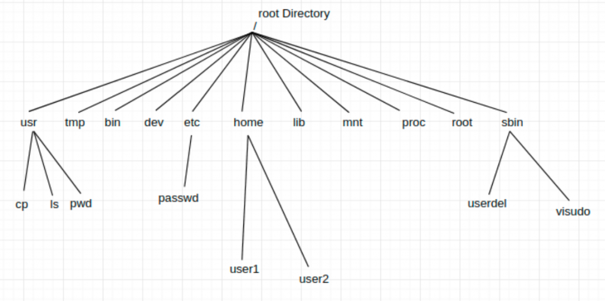

A **file system** is a method used by operating systems to store, organize, and manage data on storage devices. It provides a logical structure for accessing and managing files and directories. The **directory structure** is a key component of file systems, typically organized in a hierarchical tree format.

## Key Components of File Systems

1. **Files**: Units of data storage containing information such as text, images, or videos.
2. **Directories (Folders)**: Containers that organize files and other directories into a hierarchical structure.
3. **File Metadata**: Information about files, such as name, size, creation date, and permissions.
4. **File Paths**: Routes used to locate files within the directory hierarchy.
5. **Partitions**: Logical divisions of storage devices, each potentially formatted with its own file system.

---

## Directory Structure

The directory structure organizes files and directories in an inverted tree-like hierarchy. Below are examples of common directory structures:

### 1. **Unix/Linux Directory Structure**



In Unix-like systems, the root directory (`/`) is at the top of the hierarchy, and all other directories branch out from it:

- `/bin`: Essential binary executables.
- `/etc`: Configuration files.
- `/home`: User home directories.
- `/var`: Variable data like logs.
- `/usr`: User programs and libraries.

### 2. **Windows Directory Structure**

In Windows, the root directory is represented by a drive letter (e.g., `C:\`):

- `C:\Program Files`: Installed programs.
- `C:\Users`: User profiles and data.
- `C:\Windows`: System files.
- `C:\Temp`: Temporary files.

---

## Representation of Directory Structures

### Hierarchical Tree Representation

The directory structure can be visualized as an inverted tree:

```
Root (/ or C:\)
├── bin
├── etc
│   ├── config1
│   └── config2
├── home
│   ├── user1
│   └── user2
└── var
    ├── logs
    └── cache
```

In this representation:

- The root directory contains subdirectories (`bin`, `etc`, etc.).
- Subdirectories can contain further subdirectories or files.

### Example in Windows:

```
C:\
├── Program Files
│   ├── App1
│   └── App2
├── Users
│   ├── Public
│   └── JohnDoe
└── Windows
    ├── System32
    └── Temp
```

---

## Types of Directory Structures

1. **Single-Level Directory**:

   - All files are stored in one directory.
   - Simple but lacks organization for large systems.

2. **Two-Level Directory**:

   - Separate directories for each user.
   - Improves organization but limits cross-user file sharing.

3. **Tree-Structured Directory**:

   - Most common structure (hierarchical).
   - Allows nesting of directories for better organization.

4. **Acyclic Graph Directory**:

   - Supports shared subdirectories or files using links.
   - Avoids duplication but requires careful management to prevent loops.

5. **General Graph Directory**:
   - Extension of acyclic graphs but allows cycles (requires cycle detection).

---

The hierarchical organization provided by directory structures ensures efficient data management and accessibility across different operating systems.
