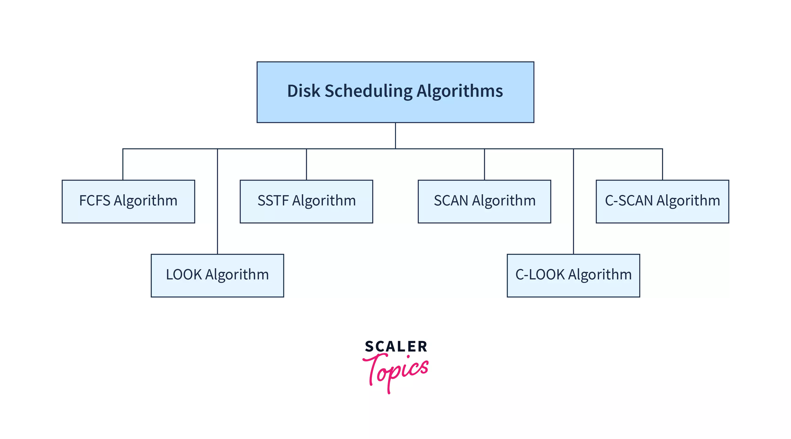

Secondary storage management involves the use of disk scheduling algorithms to efficiently manage input/output (I/O) requests to disk storage systems. These algorithms are crucial in operating systems to optimize disk access times and improve system performance. Here's an overview of the primary disk scheduling algorithms along with their representations:

## Disk Scheduling Algorithms



### 1. **First-Come-First-Served (FCFS) Algorithm**

- **Description**: This algorithm processes requests in the order they are received. It ensures that every request is served, preventing starvation but can lead to high seek times if requests are far apart.
- **Example**: Suppose a disk has requests at cylinders 98, 183, 37, 122, 14, 124, 65, and 67, with the head initially at cylinder 56. The head moves sequentially through these requests.
- **Representation**:
  ```
  Initial Head Position: 56
  Requests: 98, 183, 37, 122, 14, 124, 65, 67
  Movement: 56 → 98 → 183 → 37 → 122 → 14 → 124 → 65 → 67
  ```

### 2. **Shortest Seek Time First (SSTF) Algorithm**

- **Description**: This algorithm selects the request with the shortest seek time from the current head position. It reduces average seek time but may cause starvation for some requests.
- **Example**: Using the same request sequence as above, the head moves to the closest request first.
- **Representation**:
  ```
  Initial Head Position: 56
  Requests: 98, 183, 37, 122, 14, 124, 65, 67
  Movement: 56 → 65 → 67 → 98 → 122 → 124 → 183 → 37 → 14
  ```

### 3. **SCAN (Elevator) Algorithm**

- **Description**: The disk arm moves in one direction, servicing all requests until it reaches the end of the disk, then reverses direction.
- **Example**: Starting at cylinder 56, the arm moves towards the highest cylinder, servicing requests, then reverses direction.
- **Representation**:
  ```
  Initial Head Position: 56
  Requests: 98, 183, 37, 122, 14, 124, 65, 67
  Movement: 56 → 65 → 67 → 98 → 122 → 124 → 183 → 183 → 122 → 98 → 65 → 67 → 56 → 37 → 14
  ```

### 4. **C-SCAN (Circular-SCAN) Algorithm**

- **Description**: Similar to SCAN, but after reaching the end, the arm returns to the beginning without servicing requests on the return trip.
- **Example**: The arm moves from 56 to the highest cylinder, then returns to the start without servicing requests on the way back.
- **Representation**:
  ```
  Initial Head Position: 56
  Requests: 98, 183, 37, 122, 14, 124, 65, 67
  Movement: 56 → 65 → 67 → 98 → 122 → 124 → 183 → 0 → 14 → 37 → 56
  ```

### 5. **LOOK Algorithm**

- **Description**: The arm moves towards the last request in one direction, then reverses direction without going to the end of the disk.
- **Example**: Starting at 56, the arm moves to the last request in one direction, then reverses.
- **Representation**:
  ```
  Initial Head Position: 56
  Requests: 98, 183, 37, 122, 14, 124, 65, 67
  Movement: 56 → 65 → 67 → 98 → 122 → 124 → 183 → 183 → 122 → 98 → 65 → 67 → 56 → 37 → 14
  ```

### 6. **C-LOOK Algorithm**

- **Description**: Similar to LOOK, but after reaching the last request in one direction, the arm moves to the first request in the opposite direction without servicing requests on the way.
- **Example**: The arm moves to the last request in one direction, then returns to the first request in the other direction without servicing requests on the return trip.
- **Representation**:
  ```
  Initial Head Position: 56
  Requests: 98, 183, 37, 122, 14, 124, 65, 67
  Movement: 56 → 65 → 67 → 98 → 122 → 124 → 183 → 14 → 37 → 56
  ```

Each algorithm has its advantages and disadvantages, such as reducing seek time, preventing starvation, or minimizing wait times. The choice of algorithm depends on the specific requirements of the system and the nature of the I/O requests.

## Advantages and Disadvantages of Each Algorithm

| Algorithm  | Advantages                                                       | Disadvantages                                                                  |
| ---------- | ---------------------------------------------------------------- | ------------------------------------------------------------------------------ |
| **FCFS**   | No starvation, simple to implement                               | High seek times if requests are far apart                                      |
| **SSTF**   | Low average seek time, efficient                                 | May cause starvation for some requests                                         |
| **SCAN**   | Low average seek time, no starvation                             | May have long wait times for requests at the beginning or end of the disk      |
| **C-SCAN** | Uniform wait times, efficient                                    | May have longer total seek times compared to SCAN                              |
| **LOOK**   | Reduces unnecessary head movement, efficient                     | Requires knowledge of the last request in each direction                       |
| **C-LOOK** | Reduces unnecessary head movement, efficient, uniform wait times | Requires knowledge of the last request in each direction, complex to implement |

These algorithms are essential for optimizing disk performance in operating systems, ensuring efficient data access and retrieval.
