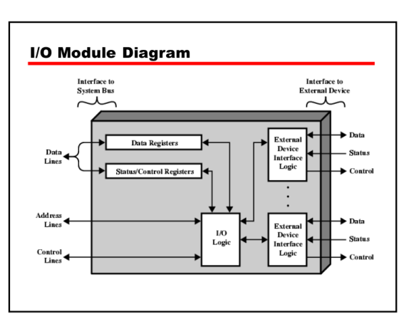

## Introduction to I/O Systems

**I/O systems** are crucial components of computing that facilitate communication between a computer and external devices or users. This interaction involves **input** (data received by the system) and **output** (data sent from the system). I/O systems are essential for user interaction, data processing, and system control.



### Key Components of I/O Systems

1. **I/O Devices**: These are hardware components used for input or output operations. Examples include keyboards (input), monitors (output), and modems (both input and output).

2. **I/O Interfaces**: These are necessary for communication between the CPU and I/O devices. They manage data transfer and conversion between different formats.

3. **Bus**: A common set of wires connecting multiple devices, allowing them to communicate with the CPU.

4. **Controllers**: These manage data transmission between devices and the computer, ensuring efficient data processing.

### Types of I/O Devices

- **Block Devices**: These handle data in fixed-size blocks, such as disk drives. They support read, write, and seek operations.
- **Character Devices**: These handle data one character at a time, such as keyboards and serial ports.
- **Network Devices**: These manage network communication and often use socket interfaces.

### I/O Operations

1. **Synchronous I/O**: The process waits until the I/O operation is completed before continuing.
2. **Asynchronous I/O**: The process continues running while the I/O operation is being performed in the background.
3. **Nonblocking I/O**: Returns immediately with available data, useful for user interfaces and buffered I/O.

### Representation of I/O Systems

I/O systems can be represented in various ways, including:

- **Block Diagrams**: These visually depict the flow of data between devices and the CPU.
- **Flowcharts**: Used to illustrate the sequence of operations in I/O processes.
- **State Transition Diagrams**: Show the different states an I/O system can be in and how it transitions between them.

### Example Representation

Here's a simplified block diagram representation of an I/O system:

```
+---------------+
|  CPU         |
+---------------+
       |
       |  Bus
       v
+---------------+
|  I/O Interface  |
+---------------+
       |
       |  Data
       v
+---------------+
|  I/O Devices   |
|  (Input/Output) |
+---------------+
```

This diagram shows the CPU communicating with I/O devices through an interface and a bus.

### Conclusion

I/O systems are fundamental to computing, enabling interaction between users, devices, and the computer itself. Understanding the components and operations of I/O systems is crucial for designing efficient and effective computing environments.
