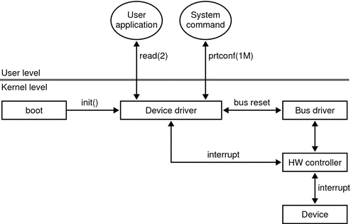

## Introduction to Device Drivers

**Device drivers** are software programs that enable communication between an operating system and specific hardware devices attached to a computer. They act as a bridge, allowing the operating system and applications to interact with hardware without needing detailed knowledge of the hardware's inner workings.



## How Device Drivers Work

1. **Communication Interface**: Device drivers provide a software interface to hardware devices, enabling operating systems and applications to access hardware functions. This communication occurs through a computer bus or a communications subsystem.

2. **Privilege Level**: Device drivers operate at a high level of privilege within the operating system's kernel, which is the part of the operating system that interacts directly with the physical hardware.

3. **Request Relay**: Drivers relay requests from the operating system and applications to the hardware devices and deliver outputs or messages from the devices back to the operating system.

## Architecture of Device Drivers

Device drivers can be divided into two main layers:

- **Logical Layer**: Processes data for a class of devices.
- **Physical Layer**: Communicates with specific device instances.

## Types of Device Drivers

- **Kernel Device Drivers**: Run in kernel mode and have direct access to hardware.
- **User Mode Device Drivers**: Run in user mode and interact with the kernel to access hardware.
- **Block Drivers** and **Character Drivers**: Handle data in blocks or characters, respectively.
- **Virtual Drivers**: Emulate hardware devices, often used in virtualization environments.

## Representation

Here is a simplified representation of how device drivers interact with hardware and the operating system:

```
+---------------+
|  Application  |
+---------------+
         |
         | Request
         v
+---------------+
| Operating System |
+---------------+
         |
         | Driver Call
         v
+---------------+
| Device Driver   |
+---------------+
         |
         | Hardware Command
         v
+---------------+
| Hardware Device  |
+---------------+
```

In this representation:

- **Applications** make requests to the **Operating System**.
- The **Operating System** uses a **Device Driver** to communicate with the **Hardware Device**.
- The **Device Driver** translates requests into commands understandable by the hardware and handles responses from the hardware.

## Purpose of Device Drivers

The primary purpose of device drivers is to provide abstraction, acting as translators between hardware devices and the applications or operating systems that use them. This allows programmers to write high-level code without needing to know the specifics of the hardware being used.
