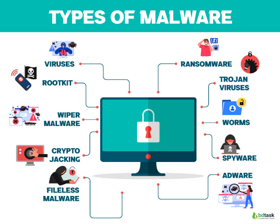

## Security Threats: Malware

**Malware**, short for malicious software, is any program or file designed to harm computer systems, networks, or servers. It is a significant security threat that can cause various types of damage, including data theft, system disruption, and resource exploitation.

### Types of Malware

1. **Viruses**: These are self-replicating programs that attach themselves to clean files and spread by executing them. Viruses can corrupt data and disrupt system functionality.

2. **Worms**: Unlike viruses, worms do not need a host program to replicate. They spread through networks, exploiting vulnerabilities without user interaction.

3. **Trojans**: These appear as legitimate software but create backdoors for other malicious programs to access the system.

4. **Spyware**: This type of malware secretly monitors user activity, collecting sensitive information like passwords and credit card details.

5. **Ransomware**: Encrypts data and demands a ransom for decryption, often causing significant disruptions.

6. **Rootkits**: Provide unauthorized access to system administrators, allowing hackers to control the system remotely.

7. **Adware**: Tracks user behavior to display targeted advertisements.

8. **Keyloggers**: Record keystrokes to capture sensitive information like login credentials.

9. **Logic Bombs**: Remain dormant until triggered by specific conditions, then cause harm.

10. **Exploits**: Take advantage of system vulnerabilities to execute malicious code.

### How Malware Infections Happen

Malware infections occur through various means:

- **Removable Drives**: Infected USB drives can automatically install malware when connected to a computer.
- **Infected Websites**: Visiting compromised websites can lead to malware downloads.
- **Phishing Attacks**: Malicious emails or messages trick users into downloading malware.
- **Third-Party Software**: Downloading software from untrusted sources can lead to malware installation.

### Impact of Malware

Malware can cause significant harm, including:

- **Data Exfiltration**: Stealing sensitive information like emails, passwords, and financial data.
- **Service Disruption**: Locking systems for ransom or disrupting critical infrastructure.
- **Identity Theft**: Using stolen personal data for fraud or unauthorized access.
- **Resource Exploitation**: Using compromised systems for spam, botnets, or cryptomining.
- **System Damage**: Corrupting files, deleting data, or altering system settings.

### Prevention and Detection

To mitigate malware threats, it's essential to use robust cybersecurity measures, including:

- **Antivirus Software**: Regularly update and scan systems for malware.
- **Firewalls**: Block unauthorized network access.
- **Secure Networks**: Use strong passwords and encryption.
- **User Education**: Avoid suspicious links and attachments.
- **Regular Updates**: Keep software and operating systems up-to-date to patch vulnerabilities.
