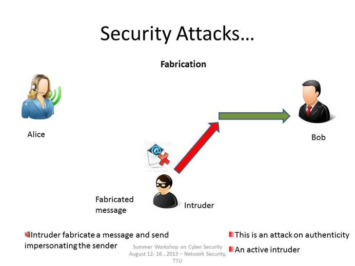

Security attacks are malicious actions designed to exploit vulnerabilities in computer systems, networks, or applications to cause harm, steal data, disrupt operations, or gain unauthorized access. These attacks can be categorized into several types based on their nature and objectives.

## Types of Security Attacks

### 1. **Active Attacks**

Active attacks involve modifying or altering system resources or data streams. They include actions like injecting malware, launching denial-of-service (DoS) attacks, or executing SQL injection attacks. Active attacks aim to disrupt the functionality of systems or networks.

- **Examples:**
  - **Malware Attacks:** These involve using malicious software like viruses, worms, or ransomware to infiltrate systems and cause harm.
  - **Denial-of-Service (DoS) Attacks:** Overwhelming a system with traffic to make it unavailable to users.
  - **SQL Injection:** Injecting malicious SQL code into web applications to access or modify sensitive data.

### 2. **Passive Attacks**

Passive attacks involve observing or intercepting data without modifying it. These attacks are typically used for espionage or to gather information without being detected.

- **Examples:**
  - **Eavesdropping:** Intercepting communications to read sensitive information without altering it.
  - **Traffic Analysis:** Analyzing network traffic patterns to infer information about the system or users.

### 3. **Phishing and Social Engineering Attacks**

These attacks exploit human psychology rather than technical vulnerabilities. They trick users into revealing sensitive information or performing certain actions.

- **Examples:**
  - **Phishing Attacks:** Using fake emails or websites to trick users into revealing passwords or credit card details.
  - **Social Engineering:** Manipulating individuals into divulging confidential information or performing unauthorized actions.

### 4. **Password Attacks**

These attacks target passwords to gain unauthorized access to systems or networks.

- **Examples:**
  - **Brute-Force Attacks:** Trying all possible combinations of passwords.
  - **Dictionary Attacks:** Using common words and phrases to guess passwords.

### 5. **Web Attacks**

These target vulnerabilities in web applications to steal data or disrupt operations.

- **Examples:**
  - **Cross-Site Scripting (XSS):** Injecting malicious scripts into web pages to execute unauthorized actions.
  - **Cross-Site Request Forgery (CSRF):** Tricking users into performing unintended actions on web applications.

## Categories of Security Threats

Security threats can also be categorized based on their goals:

- **Exploiting Weaknesses:** Attacks that exploit vulnerabilities in systems or human behavior, such as malware and social engineering.
- **Disrupting Availability:** Attacks like DoS that prevent access to systems or resources.
- **Stealing Data:** Attacks aimed at obtaining sensitive information, such as phishing and spyware.
- **Disrupting Integrity:** Attacks that alter, modify, or destroy data, such as ransomware.

Understanding these categories and types of attacks is crucial for developing effective security measures to protect against them.
