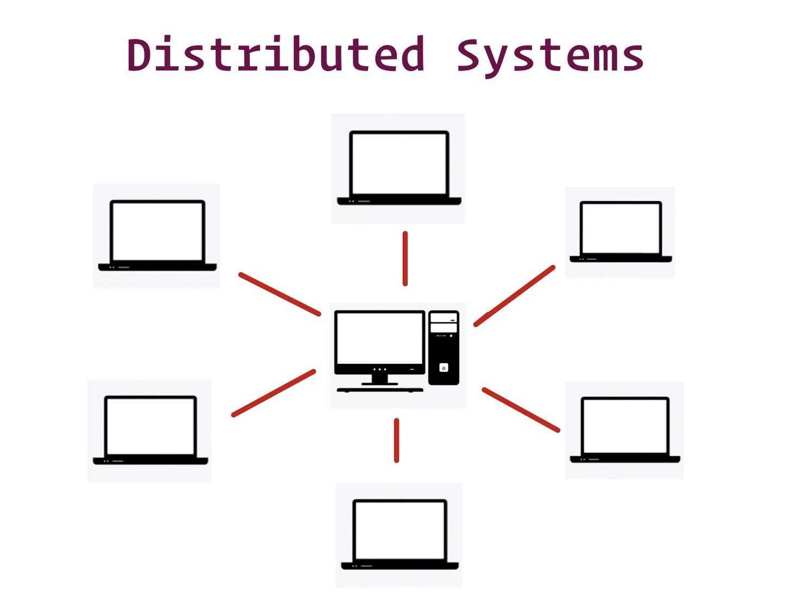

## Overview of Distributed Systems

A **distributed system** is a collection of independent components or machines located on different systems that communicate with each other to operate as a single unit. These systems aim to achieve a common goal by sharing resources, processing tasks simultaneously, and scaling as needed. Distributed systems are crucial in modern computing, enabling complex tasks beyond the capacity of a single system.

### Key Characteristics of Distributed Systems

- **Resource Sharing**: Distributed systems allow for the sharing of hardware, software, or data across different nodes.
- **Simultaneous Processing**: Multiple machines can process the same function simultaneously, enhancing efficiency.
- **Scalability**: The system can scale up by adding more machines, making it highly adaptable to increasing workloads.
- **Fault Tolerance**: The failure of one node does not lead to the failure of the entire system, ensuring continued operation.

### Types of Distributed Systems

1. **Client/Server Systems**: In this architecture, clients request resources from servers, which provide them. Servers can serve multiple clients simultaneously.
2. **Peer-to-Peer Systems**: All nodes are equal participants, sharing resources and tasks without a central server.

### Advantages of Distributed Systems

- **Scalability**: Easily add more nodes to handle increased workload.
- **Fault Tolerance**: System remains operational even if a node fails.
- **Resource Sharing**: Efficient use of resources like printers and databases.
- **Improved Performance**: Tasks are processed in parallel, enhancing overall speed.

### Disadvantages of Distributed Systems

- **Security Challenges**: Securing multiple nodes and connections is complex.
- **Data Loss**: Messages can be lost during transmission between nodes.
- **Complexity**: Managing distributed databases and networks can be challenging.

### Applications of Distributed Systems

Distributed systems are used in various applications, including:

- **Microservices Architecture**: Breaking down monolithic applications into smaller services.
- **Massively Multiplayer Online Games**: Handling large numbers of concurrent users.
- **Peer-to-Peer File Sharing**: Sharing files across a network without a central server.
- **Distributed Databases**: Storing data across multiple servers for better scalability and reliability.
