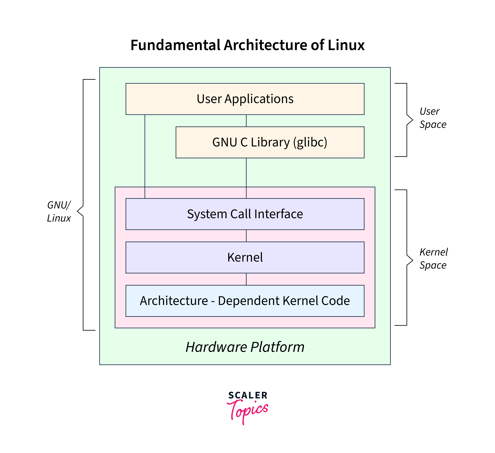

## Kernel Architecture

Kernel architecture refers to the design and structure of the kernel, which is the core component of an operating system. It acts as an intermediary between hardware and software, managing resources such as memory, CPU time, and input/output operations. There are several types of kernel architectures, including monolithic, microkernel, and hybrid.

## Overview of Kernel Architecture

### **Role of the Kernel**

- The kernel is responsible for managing system resources like memory, processors, devices, and input/output processes.
- It provides a layer of abstraction between hardware and software, allowing applications to interact with hardware without needing to know its specific details.

### **Types of Kernel Architectures**

1. **Monolithic Architecture**

   - In this architecture, the entire kernel code runs in a single address space. It includes all operating system functions within a single kernel, which enhances performance but reduces flexibility for modifications.
   - Examples include most Linux distributions and early versions of Windows.

2. **Microkernel Architecture**

   - This architecture separates the kernel into a small core that handles basic interactions with hardware and inter-process communication. Other operating system services run outside the kernel in user space.
   - Examples include Mach and QNX.

3. **Hybrid Architecture**
   - Combines elements of monolithic and microkernel architectures, offering a balance between performance and modularity. While not explicitly mentioned in the search results, it is a common approach in modern operating systems.

## Linux Kernel Architecture

The Linux kernel is both monolithic and modular. It operates in a single address space for efficiency but allows loadable kernel modules for flexibility. Key components of the Linux kernel include:

- **Process Scheduler**: Manages CPU time allocation among processes.
- **Memory Management Unit (MMU)**: Handles memory allocation and distribution.
- **Virtual File System (VFS)**: Manages file systems.
- **Networking Unit**: Handles network communications.
- **Inter-Process Communication Unit**: Facilitates communication between processes.

## Key Features of Kernel Architecture

- **User Space vs. Kernel Space**: Applications run in user space, while the kernel operates in kernel space, ensuring system stability and security.
- **System Calls**: Applications interact with the kernel through system calls, which are managed by the kernel's interface.
- **Hardware Abstraction**: Kernels provide a uniform interface to hardware, simplifying application development.
